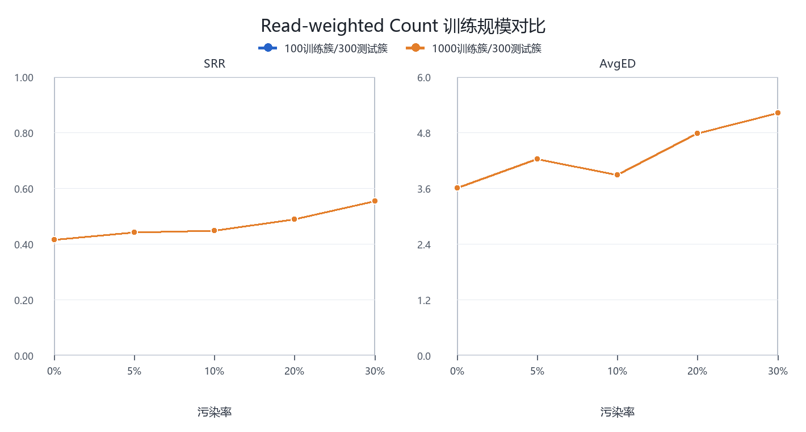
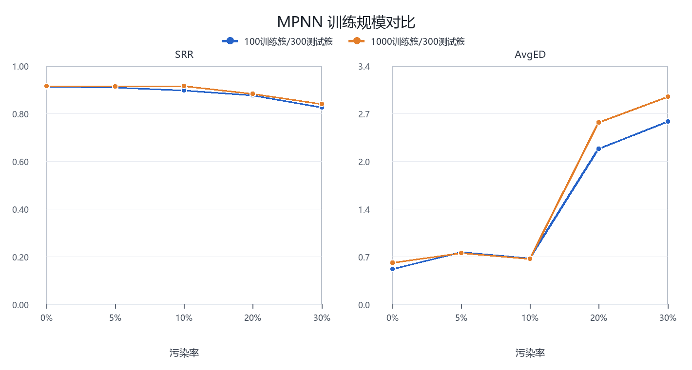
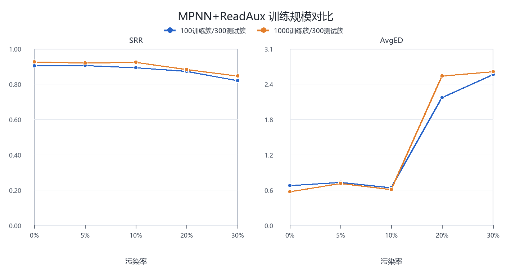
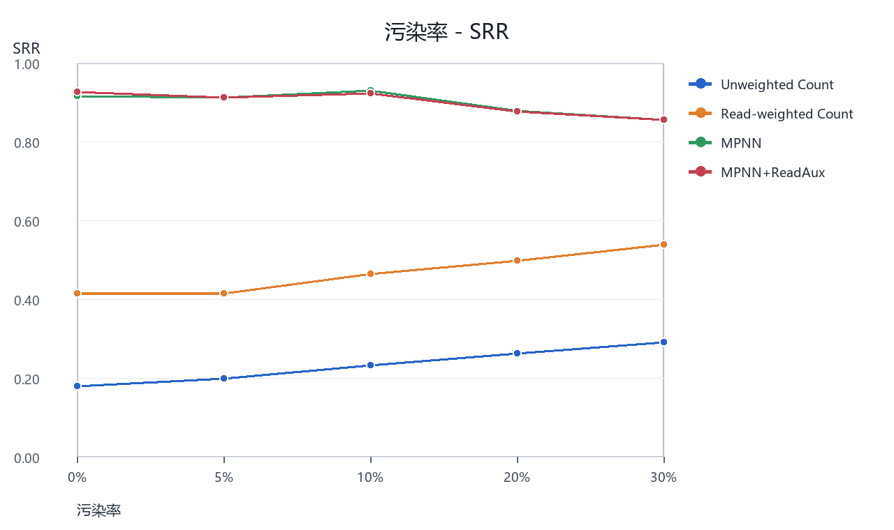
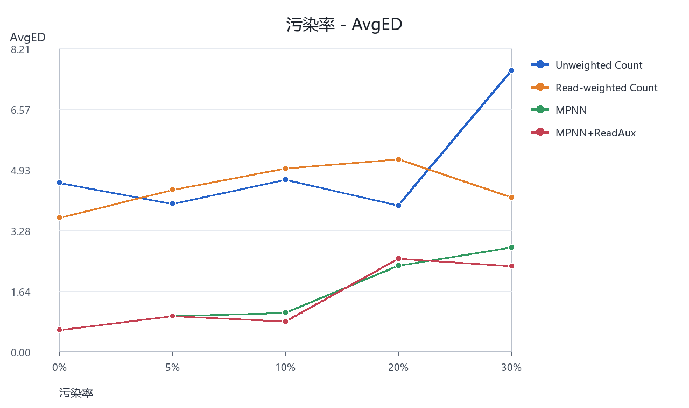
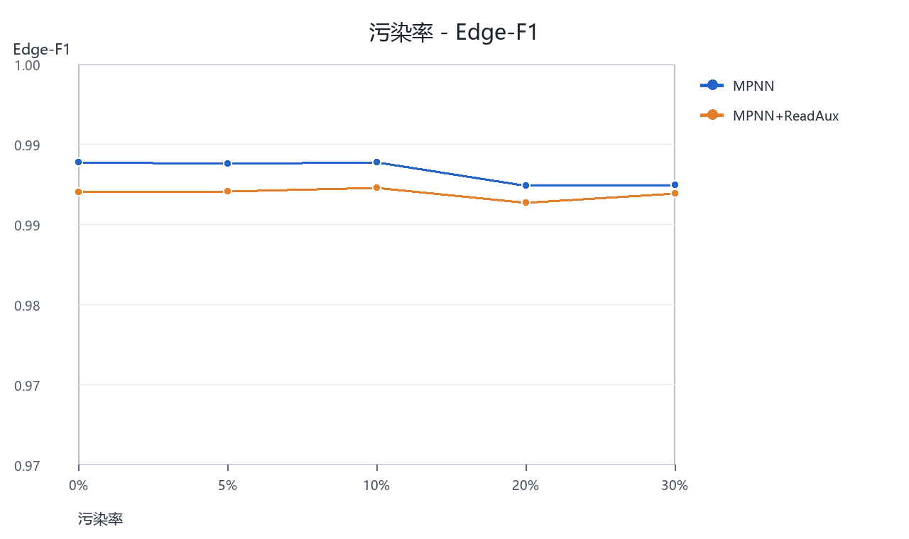
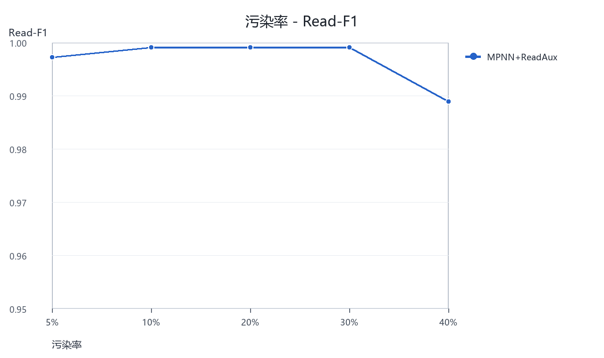
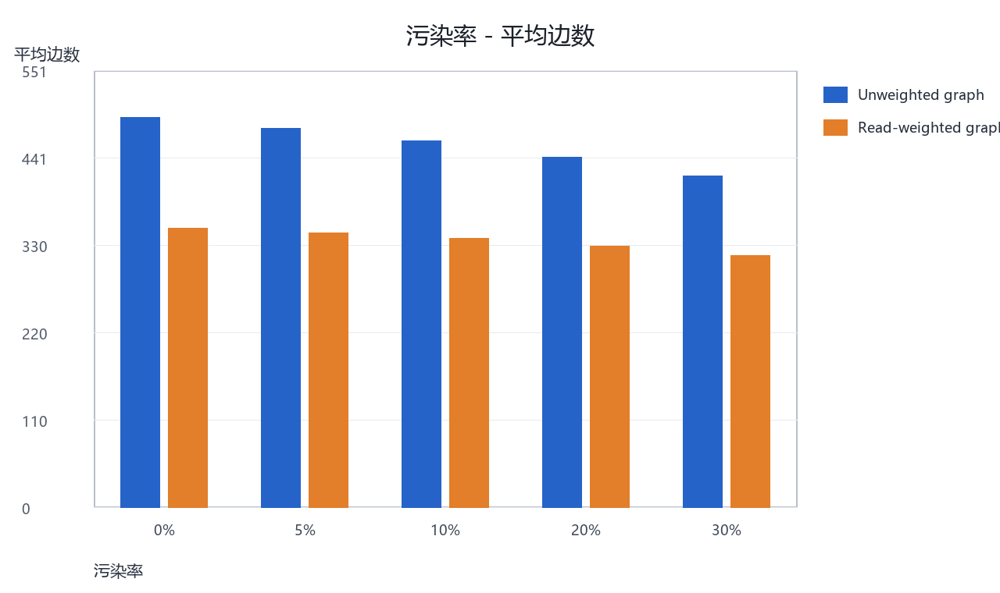

# 污染感知 DNA 存储序列重构增强分析

本文件把大规模实验结果整理为更适合课程报告使用的形式。重点不是只看 SRR，而是同时观察 SRR、BRR 和 AvgED：SRR 表示完全重构成功率，BRR 表示碱基层面的恢复比例，AvgED 表示平均编辑距离。某些方法 SRR 接近时，AvgED 仍可能不同，因此三者需要一起展示。

## 1. 主结果三指标表

### 1.1 SRR 主表

| 污染率 | Unweighted Count Beam | Read-weighted Count Beam | Read-weighted MPNN Beam | Read-weighted MPNN+ReadAux Beam |
| --- | --- | --- | --- | --- |
| 0% | 0.180 | 0.415 | 0.916 | 0.926 |
| 5% | 0.200 | 0.415 | 0.913 | 0.913 |
| 10% | 0.233 | 0.465 | 0.930 | 0.923 |
| 20% | 0.263 | 0.498 | 0.880 | 0.876 |
| 30% | 0.291 | 0.538 | 0.856 | 0.856 |

### 1.2 BRR 主表

| 污染率 | Unweighted Count Beam | Read-weighted Count Beam | Read-weighted MPNN Beam | Read-weighted MPNN+ReadAux Beam |
| --- | --- | --- | --- | --- |
| 0% | 0.958 | 0.967 | 0.995 | 0.995 |
| 5% | 0.964 | 0.960 | 0.991 | 0.991 |
| 10% | 0.958 | 0.955 | 0.990 | 0.993 |
| 20% | 0.964 | 0.953 | 0.979 | 0.977 |
| 30% | 0.931 | 0.962 | 0.974 | 0.979 |

### 1.3 AvgED 主表

| 污染率 | Unweighted Count Beam | Read-weighted Count Beam | Read-weighted MPNN Beam | Read-weighted MPNN+ReadAux Beam |
| --- | --- | --- | --- | --- |
| 0% | 4.573 | 3.632 | 0.595 | 0.582 |
| 5% | 4.007 | 4.385 | 0.963 | 0.967 |
| 10% | 4.657 | 4.963 | 1.060 | 0.823 |
| 20% | 3.953 | 5.207 | 2.338 | 2.522 |
| 30% | 7.602 | 4.171 | 2.819 | 2.321 |

## 2. Read-weighted graph 消融实验

该实验回答 read_weight 是否真正有用。结果显示，read-weighted graph 在所有污染率下均提升 Count Beam SRR，同时显著减少平均边数，说明基于 read reliability 的加权构图不只是形式上的改动，而是实际改变了图结构并抑制了污染 reads 对路径搜索的干扰。

| 污染率 | Unweighted Count Beam SRR | Read-weighted Count Beam SRR | SRR提升 | Unweighted 平均边数 | Read-weighted 平均边数 | 边数减少比例 |
| --- | --- | --- | --- | --- | --- | --- |
| 0% | 0.180 | 0.415 | 0.235 | 491.7 | 351.1 | 0.286 |
| 5% | 0.200 | 0.415 | 0.215 | 477.8 | 346.0 | 0.276 |
| 10% | 0.233 | 0.465 | 0.232 | 462.1 | 338.9 | 0.267 |
| 20% | 0.263 | 0.498 | 0.235 | 440.9 | 329.1 | 0.254 |
| 30% | 0.291 | 0.538 | 0.247 | 417.0 | 317.1 | 0.240 |

## 3. Edge-aware MPNN 贡献实验

该实验回答深度学习模型带来了什么。Read-weighted Count Beam 是较强的非学习基线；在此基础上，Edge-aware MPNN 进一步学习边是否应该出现在真实路径中，因此 SRR 明显提升、AvgED 明显下降。整体上，read-weighted graph 是基础，MPNN 是主要性能提升来源。

| 污染率 | Count Beam SRR | Count Beam AvgED | MPNN Beam SRR | MPNN Beam AvgED | MPNN+ReadAux SRR | MPNN+ReadAux AvgED | MPNN相对Count的SRR提升 |
| --- | --- | --- | --- | --- | --- | --- | --- |
| 0% | 0.415 | 3.632 | 0.916 | 0.595 | 0.926 | 0.582 | 0.502 |
| 5% | 0.415 | 4.385 | 0.913 | 0.963 | 0.913 | 0.967 | 0.498 |
| 10% | 0.465 | 4.963 | 0.930 | 1.060 | 0.923 | 0.823 | 0.465 |
| 20% | 0.498 | 5.207 | 0.880 | 2.338 | 0.876 | 2.522 | 0.381 |
| 30% | 0.538 | 4.171 | 0.856 | 2.819 | 0.856 | 2.321 | 0.318 |

## 4. ReadAux 辅助任务分析

ReadAux 不一定在每个污染率下都提升 SRR，但它能非常准确地识别污染 reads。通俗地说，模型不仅在恢复目标序列，也学会了判断哪些 reads 更可能来自外部污染。

| 污染率 | 测试来源 | Precision | Recall | Read-F1 | Accuracy |
| --- | --- | --- | --- | --- | --- |
| 5% | 1000训练簇/300测试簇 | 0.997 | 0.997 | 0.997 | 1.000 |
| 10% | 1000训练簇/300测试簇 | 0.998 | 1.000 | 0.999 | 1.000 |
| 20% | 1000训练簇/300测试簇 | 0.999 | 0.999 | 0.999 | 1.000 |
| 30% | 1000训练簇/300测试簇 | 1.000 | 0.999 | 0.999 | 1.000 |
| 40% | 40%补充测试/50测试簇 | 1.000 | 0.976 | 0.988 | 0.990 |

## 5. 100 训练簇 vs 1000 训练簇

该组结果使用同一批 300 个测试簇，用于观察训练簇数量变化对重构性能、边判别能力和污染读段识别能力的影响。

### 5.1 100 训练簇结果表

| 污染率 | 方法 | SRR | BRR | AvgED |
| --- | --- | --- | --- | --- |
| 0% | Read-weighted Count Beam | 0.415 | 0.967 | 3.632 |
| 0% | Read-weighted MPNN Beam | 0.913 | 0.995 | 0.505 |
| 0% | Read-weighted MPNN+ReadAux Beam | 0.903 | 0.994 | 0.692 |
| 5% | Read-weighted Count Beam | 0.441 | 0.961 | 4.254 |
| 5% | Read-weighted MPNN Beam | 0.910 | 0.993 | 0.742 |
| 5% | Read-weighted MPNN+ReadAux Beam | 0.906 | 0.993 | 0.746 |
| 10% | Read-weighted Count Beam | 0.448 | 0.964 | 3.910 |
| 10% | Read-weighted MPNN Beam | 0.896 | 0.994 | 0.652 |
| 10% | Read-weighted MPNN+ReadAux Beam | 0.893 | 0.994 | 0.652 |
| 20% | Read-weighted Count Beam | 0.488 | 0.956 | 4.813 |
| 20% | Read-weighted MPNN Beam | 0.876 | 0.980 | 2.214 |
| 20% | Read-weighted MPNN+ReadAux Beam | 0.873 | 0.980 | 2.214 |
| 30% | Read-weighted Count Beam | 0.555 | 0.952 | 5.251 |
| 30% | Read-weighted MPNN Beam | 0.826 | 0.976 | 2.602 |
| 30% | Read-weighted MPNN+ReadAux Beam | 0.819 | 0.976 | 2.609 |

### 5.2 1000 训练簇结果表

| 污染率 | 方法 | SRR | BRR | AvgED |
| --- | --- | --- | --- | --- |
| 0% | Read-weighted Count Beam | 0.415 | 0.967 | 3.632 |
| 0% | Read-weighted MPNN Beam | 0.916 | 0.995 | 0.595 |
| 0% | Read-weighted MPNN+ReadAux Beam | 0.926 | 0.995 | 0.582 |
| 5% | Read-weighted Count Beam | 0.441 | 0.961 | 4.254 |
| 5% | Read-weighted MPNN Beam | 0.913 | 0.993 | 0.732 |
| 5% | Read-weighted MPNN+ReadAux Beam | 0.920 | 0.993 | 0.729 |
| 10% | Read-weighted Count Beam | 0.448 | 0.964 | 3.910 |
| 10% | Read-weighted MPNN Beam | 0.916 | 0.994 | 0.645 |
| 10% | Read-weighted MPNN+ReadAux Beam | 0.923 | 0.994 | 0.619 |
| 20% | Read-weighted Count Beam | 0.488 | 0.956 | 4.813 |
| 20% | Read-weighted MPNN Beam | 0.883 | 0.976 | 2.589 |
| 20% | Read-weighted MPNN+ReadAux Beam | 0.883 | 0.976 | 2.589 |
| 30% | Read-weighted Count Beam | 0.555 | 0.952 | 5.251 |
| 30% | Read-weighted MPNN Beam | 0.839 | 0.973 | 2.950 |
| 30% | Read-weighted MPNN+ReadAux Beam | 0.846 | 0.976 | 2.659 |

### 5.3 方法级训练规模对比图

每张图对应一个方法，左侧展示 SRR，右侧展示 AvgED，用于观察 100 训练簇和 1000 训练簇在不同污染率下的差异。

## 6. 曲线图

## 7. 代表性簇案例分析

案例分析基于预测序列与参考序列的编辑差异，以及该簇的污染率、平均 read_weight 等信息。bridge/bypass 判断是根据插入、删除和局部错误分布得到的启发式分析，用于帮助解释错误类型。

| 案例 | cluster_id | 污染率 | 参考序列长度 | 主要失败方法 | 主要改进方法 | 失败方法ED | 改进方法ED | 错误集中位置 | bridge/bypass判断 | 污染reads支持判断 |
| --- | --- | --- | --- | --- | --- | --- | --- | --- | --- | --- |
| Count Beam 失败但 MPNN 成功 | 3551 | 30% | 110 | Read-weighted Count Beam | Read-weighted MPNN Beam | 87 | 0 | 错误主要位于参考序列第 1-6、8-14、16-26、28-32、... 位附近；替换 0 个、删除 87 个、插入 0 个。 | 错误以删除为主，可能存在绕过真实片段的 bypass 类风险。 | 平均 read_weight 较低，说明簇内 reads 可靠性分化明显，错误路径存在被污染 reads 支持的风险。 |
| Count Beam 失败但 ReadAux 成功 | 2218 | 30% | 110 | Read-weighted Count Beam | Read-weighted MPNN+ReadAux Beam | 84 | 0 | 错误主要位于参考序列第 1-6、10-13、15、17-27、... 位附近；替换 0 个、删除 84 个、插入 0 个。 | 错误以删除为主，可能存在绕过真实片段的 bypass 类风险。 | 平均 read_weight 较低，说明簇内 reads 可靠性分化明显，错误路径存在被污染 reads 支持的风险。 |
| MPNN 未完全正确但 ReadAux 降低 AvgED | 2400 | 30% | 110 | Read-weighted MPNN Beam | Read-weighted MPNN+ReadAux Beam | 75 | 2 | 错误主要位于参考序列第 24-48、51-58、60-67、69-80、... 位附近；替换 0 个、删除 75 个、插入 0 个。 | 错误以删除为主，可能存在绕过真实片段的 bypass 类风险。 | 平均 read_weight 较低，说明簇内 reads 可靠性分化明显，错误路径存在被污染 reads 支持的风险。 |
